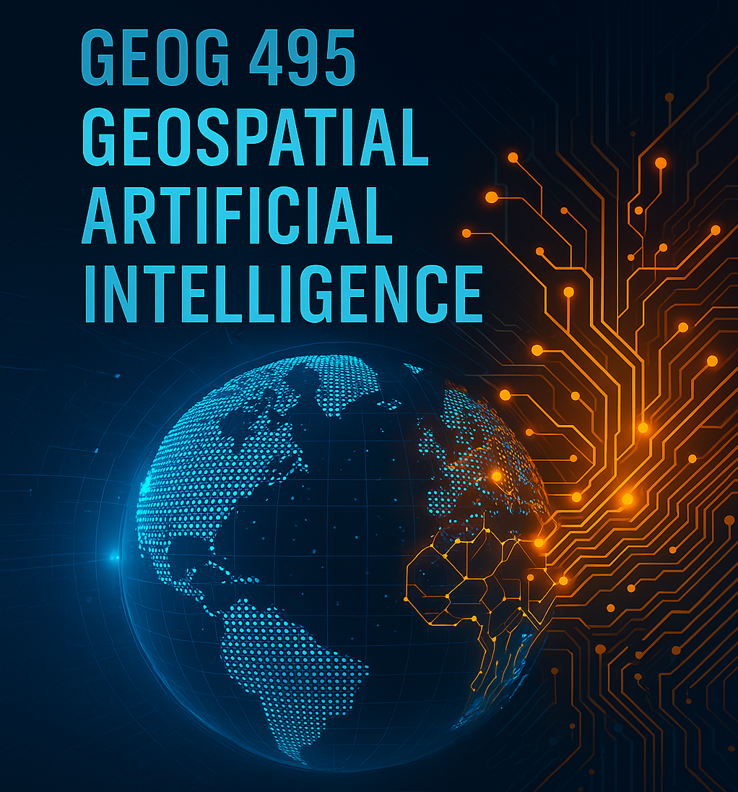

# **GEOG495/GEOG428: Geospatial Artificial Intelligence**

- **Instructor:** Bo Zhao, zhaobo@uw.edu, Office Hours: by Appt or via Zoom: https://t.ly/kpj_t 
- **Teaching Assistant:** Liz Peng, lp36@uw.edu, Office Hours: TBD
- **Meeting Time:** Asynchronous Online

  This course explores the emerging field of Geospatial Artificial Intelligence (GeoAI), focusing on the integration of machine learning, deep learning, and large language models (LLMs) in the context of geographic data. Students will engage both technically and critically with the tools and concepts shaping the future of spatial and placial analysis. This crush course emphasizes hands-on lab experimentation, paper-driven learning, and critical reflection on the social and epistemological implications of AI-powered geospatial technologies.

The course is both reading- and lab-driven, structured to balance technical engagement with critical reflection. Each week begins with a set of approximately three assigned readings, where students are encouraged to engage actively by bringing in real-world examples and posing critical questions. Most readings are available in the “readings” folder of the course GitHub repository; if not, they can typically be accessed through the UW Library system. Lab sessions are guided but self-directed, offering space for open experimentation, problem-solving, and reflective analysis. You are required to complete four out of the seven total labs: choose either Lab 1 or 2 for Week 1, Lab 3 or 4 for Week 2, Lab 5 or 6 for Week 3, and complete Lab 7 for Week 4. Additionally, one quiz will be assigned each week during the first three weeks, and the final essay is due by the end of Week 4. **New to Google Colab? No worries—check out [this tutorial](https://colab.research.google.com/) to get started.**

### Course Objectives

* **Understand** the technical foundations and workflows of GeoAI, including machine learning, deep learning, and LLMs.
* **Apply** open-source tools (Google Colab and Gemini) to analyze spatial data.
* **Critically evaluate** the societal, ethical, and epistemological dimensions of AI in geography.
* **Engage with** latest academic literature through weekly readings and reflections.
* **Produce** an independent final essay demonstrating synthesis of technical and critical insights.

> This web page is the syllabus - There is no printed version, please refer here instead. Make sure refer to this page as often as possible. Also, Feel free to ask the instructor for clarifications whenever needed.

---

## Weekly Schedule

### **Week 1: Introduction & Machine Learning for Spatial Data**

We begin with an overview of GeoAI’s evolution and its intersections with geographic thought. Students are introduced to foundational machine learning techniques applied to spatial data using Google Colab. This week sets the tone for the course by situating GeoAI within both technical and critical frameworks.

<b>Readings, Labs, Quiz and Weekly Reflections</b>

1. Li, W., Arundel, S. T., Gao, S., Goodchild, M. F., Hu, Y., Wang, S., & Zipf, A. (2024). GeoAI for science and the science of GeoAI. Journal of Spatial Information Science, (29), 1–25. [💾](readings/wk01/)
2. Raschka, S., & Mirjalili, V. (2019). Python machine learning: Machine learning and deep learning with Python, scikit-learn, and TensorFlow 2. Packt publishing ltd. Please read Preface, Chapters 1, 2, 3, 4 & 6. You can access the book online by logging in with your UW email through O'Reilly Learning. [💾](https://learning.oreilly.com/library/view/python-machine-learning/9781789955750/Text/Preface.xhtml)

Reading Reflection 1 on Li et al.'s paper (2024)

Lab 1: [Predicting Boston Housing Prices Using Machine Learning](labs/lab01/)

Lab 2: [Downscaling Urban Heat of Seattle Using Random Forests](labs/lab02)

Quiz 1 on Machine Learning

### **Week 2: Place, Space and Deep Learning**

This week introduces deep learning architectures for interpreting raster imagery, focusing on CNNs for classification and segmentation. Students also critically reflect on the politics of computer vision, data labeling, and representation in spatial AI.

<b>Readings, Labs, Quiz and Weekly Reflections</b>

1. Zhao, B., Zhang, S., Xu, C., Sun, Y., & Deng, C. (2021). Deep fake geography? When geospatial data encounter Artificial Intelligence. Cartography and Geographic Information Science, 48(4), 338-352. [💾](readings/wk02/)
2. Janowicz, K., Sieber, R., & Crampton, J. (2022). GeoAI, counter-AI, and human geography: A conversation. Dialogues in Human Geography, 12(3), 446-458. [💾](readings/wk02/)
3. Raschka, S., & Mirjalili, V. (2019). Python machine learning: Machine learning and deep learning with Python, scikit-learn, and TensorFlow 2. Packt publishing ltd. Please read Chapters 15 & 17. You can access the book online by logging in with your UW email through O'Reilly Learning. [💾](https://learning.oreilly.com/library/view/python-machine-learning/9781789955750/Text/Preface.xhtml)

Reading Reflection 2 on either Zhao et al.'s paper (2021) or Janowicz et al's paper (2022).

Lab 3: [Using YOLO to Detect Homeless Camps in Seattle Urban Spaces](labs/lab03/)

Lab 4: [Geospatial Segmentation with SAM: Deep Learning for Tree Canopy Detection](labs/lab04/)

Quiz 2 on Deep Learning 

### **Week 3: Large Language Models for Mapping and Geospatial Reasoning**

This week turns to natural language as a mode of spatial analysis. Students explore how LLMs like ChatGPT can perform geocoding, generate maps, and interpret GIS data from text prompts. Discussions center around the promises and limitations of natural language interfaces.

<b>Readings, Labs, Quiz and Weekly Reflections</b>

1. Manvi, R., Khanna, S., Mai, G., Burke, M., Lobell, D., & Ermon, S. (2023). GeoLLM: Extracting geospatial knowledge from large language models. arXiv preprint arXiv:2310.06213. https://arxiv.org/abs/2310.06213 [💾](readings/wk03/)
2. Lin, Y., & Zhao, B. (2025). Posthuman cartography? Rethinking artificial intelligence, cartographic practices, and reflexivity. Annals of the American Association of Geographers, 115(3), 499-512. [💾](readings/wk03/)
3. Amaratunga, T. (2023). Understanding large language models: Learning their underlying concepts and technologies. Berkeley, CA: Apress. Please read the whole book. You can access the book online by logging in with your UW email through Springer.[💾](https://link.springer.com/book/10.1007/979-8-8688-0017-7)

Reading Reflection 3 on either Lin and Zhao's paper (2025) or Manvi et al.'s paper (2023)

Lab 5: [Prompt-to-Map: Using LLMs for Map Generation and Spatial Analysis](labs/lab05)

Lab 6: [Prompting Geospatial Reasoning: Understanding Space and Place with Gemini](labs/lab06)

Quiz 3 on Large Language Models

### **Week 4: A Deep Dive into GeoAI: Hallucinations, Bias, and Sustainability**

We conclude by examining the socio-technical risks of GeoAI. Students critically assess hallucinations, embedded bias, and environmental impacts of AI. The week culminates in an exploratory lab and final reflection.

<b>Readings, Labs, and Final Essay</b>

1. Gurnee, W., & Tegmark, M. (2023). Language models represent space and time. arXiv preprint arXiv:2310.02207. [💾](readings/wk04/)
2. Li, P., Yang, J., Islam, M. A., & Ren, S. (2023). Making ai less" thirsty": Uncovering and addressing the secret water footprint of ai models. arXiv preprint arXiv:2304.03271. [💾](readings/wk04/)
3. Gillespie (2024). Generative AI and the politics of visibility. Big Data & Society. [💾](readings/wk04/)

Lab 7: [Critical Exam of GeoAI: Collapse, Hallucination, Bias, and the Limits of Geospatial Intelligence](labs/lab07)

---

### Computational skill

This course welcomes students who some computational experience, or have programmed in a python or javascript IDE (Integrated Development Environment), especially Google CoLab. Students should at least hear of GIS, GitHub, LLMs before considering this course, and most importantly, be self-motivated to solve a research question with the listed computational skills.

### GitHub

This course material will be hosted on GitHub instead of UW Canvas. On this dedicated GitHub repository for this course, you can find most of the course material, participate in group discussions by submitting GitHub issues, and creating new GitHub repositories to turn in practical exercise deliverables. By the end of this quarter, you will be more proficient in operating a cloud-based coding environment and able to host your work online as a way to gain public and peer attentions.

### Quizzes

There will be **three short quizzes** administered throughout the course to assess your foundational understanding of key GeoAI concepts. Each quiz aligns with the major technical focus of the corresponding week:

- **Week 1 Quiz:** Focuses on **machine learning fundamentals**, especially as introduced in the selected chapters from the book **Python machine learning**.
- **Week 2 Quiz:** Covers **deep learning basics**, guided by the technical content in the assigned deep learning chapters from the book **Python machine learning**.
- **Week 3 Quiz:** Centers on the core concepts behind **large language models (LLMs)**, drawing from technical materials from the book **Understanding large language models**.

These quizzes are **open-note**, **untimed**, and designed to be approachable. They will include a mix of multiple-choice, short answer, and code interpretation questions, but **will not require advanced mathematics**. The primary goal is not to test memorization or complex calculations, but to help you **solidify a general understanding** of how machine learning, deep learning, and LLMs work in the context of geospatial data. Think of them as low-stakes checkpoints that prepare you for more hands-on, applied lab work in later weeks.

### Lab Exercises

Over the course of four weeks, students are required to complete **four out of seven total hands-on lab assignments**. Each lab focuses on applying machine learning, deep learning, or large language models (LLMs) to geospatial data, using **Google Colab** as the development environment. All labs involve writing and executing Python code. Your code should be **clearly organized, well-commented, and fully reproducible**. Final versions of your labs must be submitted via **GitHub**, accompanied by a short `README` file that explains the **objective**, **approach**, and **key outcomes** of your work. To allow for flexibility while ensuring coverage of core topics, you will follow this structure:

- **Week 1:** Complete **either Lab 1 or Lab 2**
- **Week 2:** Complete **either Lab 3 or Lab 4**
- **Week 3:** Complete **either Lab 5 or Lab 6**
- **Week 4:** Complete **Lab 7 (required)**

These labs are designed not only to build technical proficiency, but also to promote **critical reflection** on the design, application, and implications of GeoAI methods.

💡 **Tip:** Treat each lab as both a technical experiment and a space for critical thinking—consider not just *how* the models work, but *why* they matter in geographic contexts.

### Reading Reflection

Your weekly reading reflection should be at least **350 words** in length and must **critically engage with the specific paper(s) assigned for that week**. The required papers are clearly listed in the course schedule—please make sure your reflection is centered on those. There is no fixed structure you must follow—feel free to experiment with tone and format—but ensure your writing is clear, well-organized, and free of typos. Be sure to cite your sources appropriately. 

Here are some suggestions to help guide your writing:

- While a formal essay structure isn’t necessary, clarity, coherence, and a clear point of view are essential.
- Avoid merely summarizing the text. Instead, develop your own insights and connect them to both the readings and the week’s lab activities.
- Go beyond surface-level observations. Aim to make one or more well-developed arguments or reflections.
- Use examples and direct quotations from the readings to support your points. Well-chosen quotes can strengthen your analysis.
- Focus on intellectual engagement with the text rather than personal feelings. Whether you liked the reading is secondary to what you learned or questioned.
- Draw connections between the readings and broader course themes, and most importantly, explore your own critical ideas about the assigned paper(s).

### Final Essay

The final essay is due at the end of **Week 4** and should be between **2,500 and 3,000 words** (not exceeding 5,000 words in total). This assignment functions as a **research proposal**, where you synthesize technical skills with critical reflection to explore a topic related to GeoAI.

You are encouraged to choose either a proposal topic that critically investigates **GeoAI technologies themselves** (e.g., hallucinations in LLMs applied to spatial data, model bias, or AI's environmental footprint); **or** A project that uses **GeoAI methods to study a broader social, environmental, or spatial issue**, where you also reflect on the implications and challenges of applying AI to that issue. In either case, the goal is to demonstrate your ability to combine technical application with critical inquiry. The essay must incorporate **at least two technical sources and two critical sources**, which can come from course readings or your own independent research.

While preliminary results are welcome, they are **not required**. What we are primarily looking for is a **thoughtful, well-structured proposal** that includes:

- A **clear research question or problem statement**
- A plan for **data collection** (what data, how to obtain it, and why it's appropriate)
- The **methods or models** you propose to use (e.g., random forests, CNNs, LLMs)
- An outline of how you intend to perform **evaluation and validation**
- A section on **critical reflection**: What social, ethical, or epistemological implications does your project raise?

This essay is not just about applying a method, but about showing how you understand and contextualize that method within real-world geographic, social, or environmental challenges.

### Evaluation

Your final grade will be based on the following components:

| Component               | Weight |
| ----------------------- | ------ |
| Lab Assignments (4)     | 40%    |
| Final Essay             | 25%    |
| Reading Reflections (3) | 26%    |
| Quizzes (3)             | 9%     |

Each component is designed to balance technical practice with critical engagement. Completing all required pieces on time and with care is essential for success in the course.

### Equity & Inclusivity

Our very highest priorities include creating a brave and supportive class environment where each of us contributes, we can ask big questions, we give and receive critiques in a supportive way, we notice and engage the ways that we are differently situated within past and present relationship of power, privilege and oppression. I invite you to think hard about how race, gender identity, religion, age, citizenship status, first language, ability, sexuality, class, and other axes are at work in our interactions, and what this might mean in terms of when to speak up, when to step back, how to listen, and much more. Each of you is a welcome and invaluable part of our collective whole.

### Disability Accommodations

We welcome the opportunity to work with any students with disabilities in this class to ensure equal access to the course. If you have a letter from Disability Resources for Students (DRS) outlining your academic accommodations, please present the letter to me (or email us, to confirm, if the letter is electronic) as soon as possible so that we can discuss the accommodations you may need for this class. Any discussions between student and professor need to occur as early as possible in order for adequate arrangements to be made. If you do not yet have a letter from DRS, but would like to request academic accommodations due to a disability, please contact DRS [here)](https://depts.washington.edu/uwdrs/), or in-person at 011 Mary Gates Hall, or at 206-543-8924 (Voice & Relay), [uwdrs@uw.edu](mailto:uwdrs@uw.edu).

### Religious Accommodations

Washington state law requires that UW develop a policy for accommodation of student absences or significant hardship due to reasons of faith or conscience, or for organized religious activities. The UW’s policy, including more information about how to request an accommodation, is available at [Religious Accommodations Policy](https://registrar.washington.edu/staffandfaculty/religious-accommodations-policy/). Accommodations must be requested within the first two weeks of this course using the [Religious Accommodations Request form](https://https:/registrar.washington.edu/students/religious-accommodations-request/).

### Student Care & Safety

It is important that you take care of yourselves inside and outside of class as you work through stress and other obstacles. There are many different support services on campus that can help, such as the Counseling Center, Hall Health, and the IMA. UW’s Student Care program can help you connect to these and other resources. Learn more an contact them directly: http://depts.washington.edu/livewell/student-care/, livewell@uw.edu, or 206.543.6085. If you are concerned about yourself or a friend who is struggling SafeCampus is a helpful resource. Please add 206.685.7233 to your phones.

### Acknowledgement

 This course advocates for the open culture. The course materials are open source for both students and open source community to access. The development of this course was inspired and supported by many generous colleagues and students. I would like to thank Professor Yue Lin (University of Illinois Urbana-Champaign) for their valuable insights. I’m also grateful to Yifan Yang, Haowen Wei, and Tongwei Xu who contributed to early explorations with Syllabus and the initial shape of this course during Summer 2024.

`© 2019-2025 All rights are reserved by Bo Zhao.`
wo